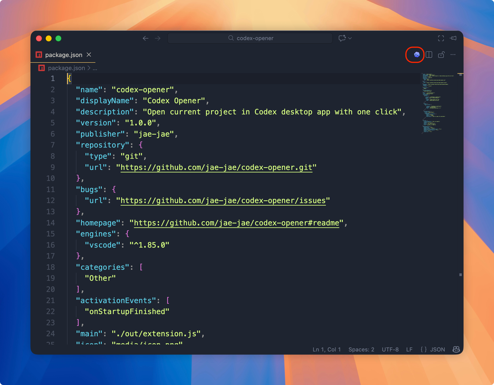

<div align="center">
  
</div>

# Codex Opener

A VS Code extension that adds a button to open your current project in [Codex](https://github.com/openai/codex) desktop app with one click.

## Features

- One-click button in editor title bar
- Automatically activates Codex window (even when minimized)
- Works on macOS, Windows, and Linux
- No configuration needed

## Installation

### From Marketplace

Search **"Codex Opener"** in VS Code Extensions marketplace, or click:

- [VS Code Marketplace](https://marketplace.visualstudio.com/items?itemName=Jaeger.codex-opener)
- [Open VSX Registry](https://open-vsx.org/extension/Jaeger/codex-opener)

### From Releases

Download the latest `.vsix` file from [Releases](https://github.com/jae-jae/codex-opener/releases) and install:

```bash
code --install-extension codex-opener-*.vsix
```

## Requirements

- [Codex CLI](https://github.com/openai/codex) installed
- [Codex Desktop](https://github.com/openai/codex) installed

## Usage

1. Open a folder/workspace in VS Code
2. Click the Codex icon in the editor title bar (top right)
3. Your project opens in Codex Desktop

## Configuration

| Setting | Default | Description |
|---------|---------|-------------|
| `codexOpener.codexPath` | `codex` | Path to codex CLI executable |

## License

MIT
